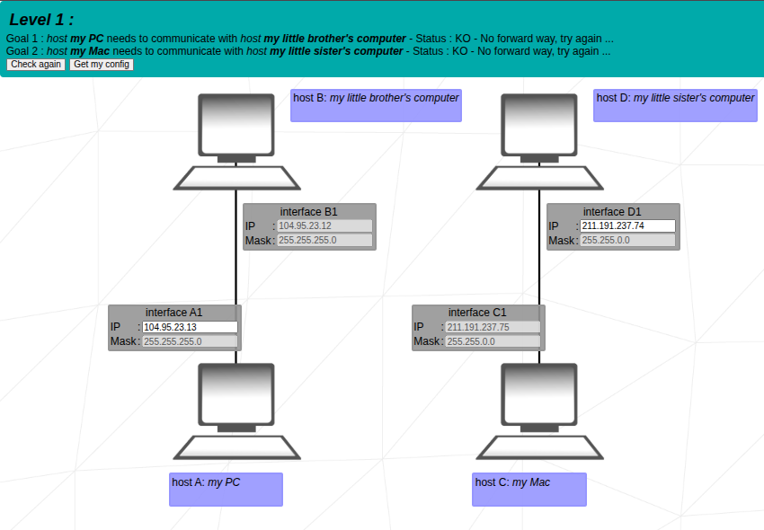
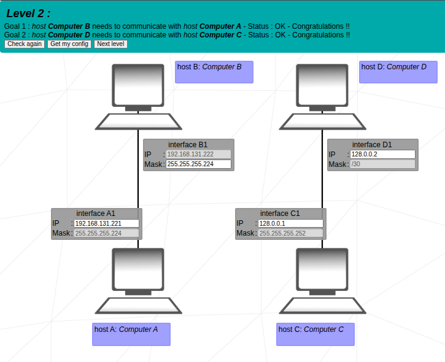
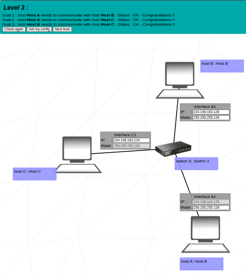
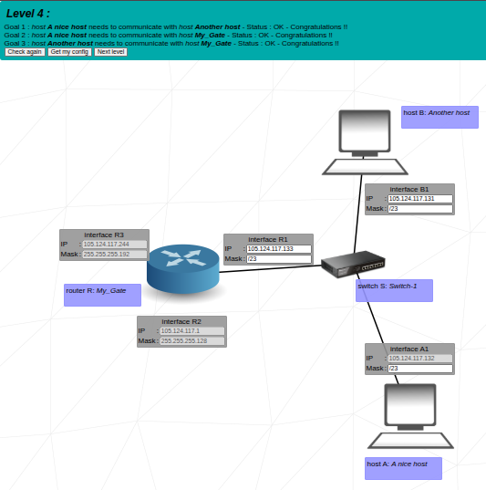
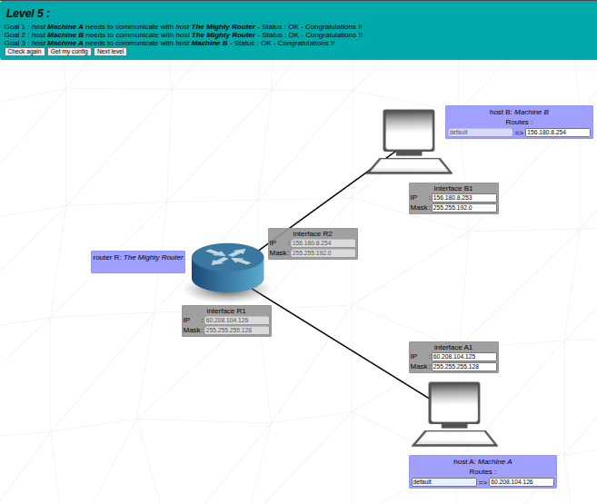
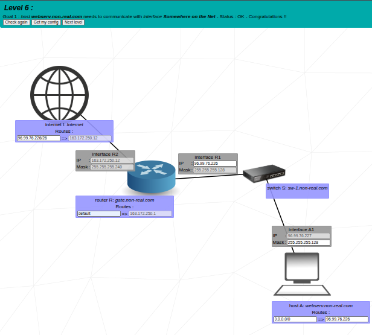
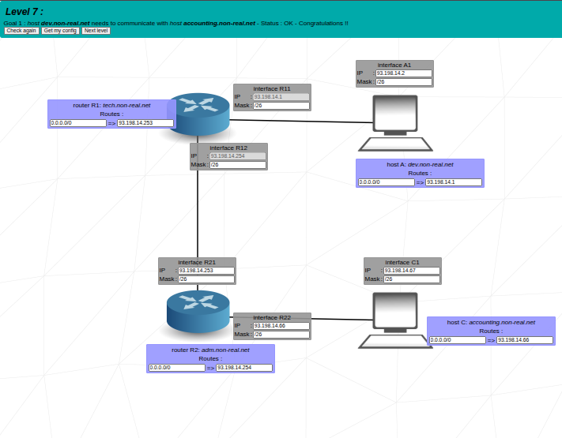
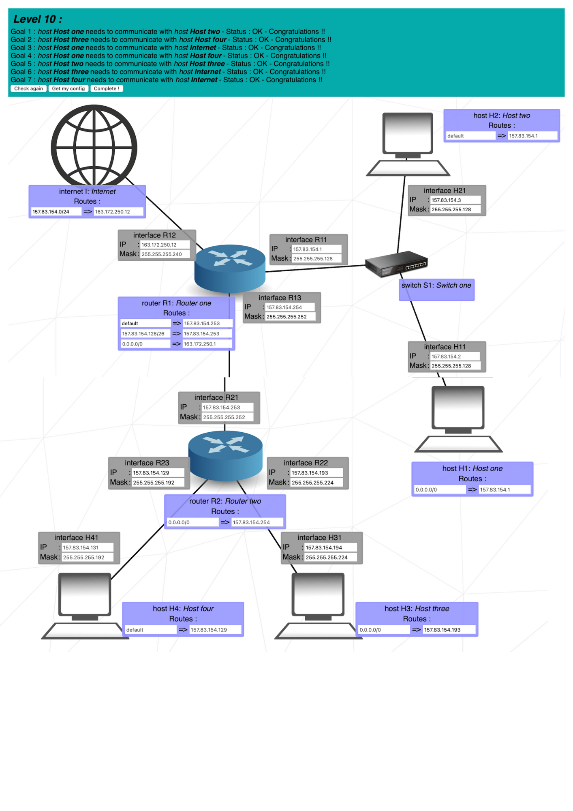
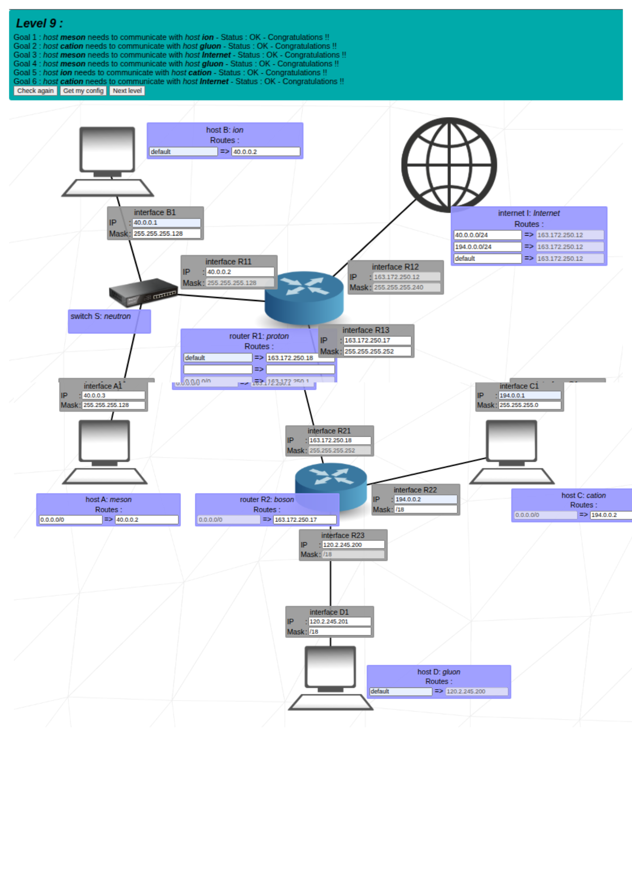

# 🌐 NetPractice - Guía Rápida

Mini guía para entender el proyecto **NetPractice (42 Madrid)**.  

---

## 📑 Índice
1. [TCP](#-tcp-transmission-control-protocol)  
2. [Dirección IP](#1️⃣-dirección-ip-internet-protocol)  
3. [Máscaras de Subred](#2️⃣-máscaras-de-subred-subnet-mask)  
4. [Switch](#3️⃣-switch)  
5. [Router](#4️⃣-router)  
6. [Gateway](#5️⃣-gateway)  
7. [Levels](#🎮-levels)

## ⚡ TCP (Transmission Control Protocol)
- Permite que los programas y dispositivos intercambien mensajes a través de la red.
- Antes de transmitir datos, **establece una conexión** entre origen y destino.
- La conexión se mantiene activa mientras dura la comunicación.
- Se usa junto a **IP** para enviar paquetes en Internet → **TCP/IP**.

---

## 1️⃣ Dirección IP (Internet Protocol)
- Identifica a un dispositivo dentro de una red.
- Funciona como tu dirección en la vida real: alguien necesita saber **dónde enviarte los paquetes**.
- Ejemplo IPv4 → `192.168.1.10`

### 🔹 Tipos de IP
- **IP fija (Static IP)**  
  - Configurada manualmente.  
  - Siempre la misma.  
  - Útil para: servidores, impresoras, cámaras.  

- **IP dinámica (Dynamic IP)**  
  - Asignada automáticamente por el router (DHCP).  
  - Puede cambiar al reconectarse.  
  - Lo más común en PCs, móviles, invitados.  

### 🔹 IP pública vs. IP privada
- 🌍 **IP pública** → tu dirección en Internet.  
  - Te la da tu proveedor (Movistar, Vodafone…).  
  - Ejemplo: `104.198.241.125`

- 🏠 **IP privada** → tu dirección dentro de la red local.  
  - Te la da tu router.  
  - Ejemplo: `192.168.1.25`  
  - Solo funciona dentro de tu LAN.  

### 🔹 Partes de una IP
- **Red** → indica a qué red pertenece el dispositivo.  
- **Host** → indica qué dispositivo específico es.  

👉 Cada **host** (PC, móvil, impresora, etc.) tiene una IP única en la misma red.  

---

## 2️⃣ Máscaras de Subred (Subnet Mask)
- Indican qué parte de la IP corresponde a la **red** y qué parte al **host**.
- Se usan para dividir redes grandes en **subredes más pequeñas**.

Ejemplo: 
IP: 192.168.1.10
Máscara: 255.255.255.0

➡ Los tres primeros bloques (`192.168.1`) son **red**, el último (`10`) es **host**.

### 🔹 ¿Para qué sirven?
- **Organización** → separar oficinas, servidores, invitados.  
- **Seguridad** → reglas distintas según la subred.  

### 🔹 Ejemplo de subredes
- Oficinas → `192.168.1.0/24`
- Servidores → `192.168.2.0/24`
- Invitados → `192.168.3.0/24`

### 🔹 Funcionamiento
- La máscara se compone de **1s** (red) y **0s** (host).  
- Ejemplo `/24`:  
  - 24 unos → parte de red.  
  - 8 ceros → parte de host.  

⚠️ Dentro de cada subred:
- **Primera dirección** = dirección de red.  
- **Última dirección** = broadcast.  
---
## 3️⃣ Switch
- Es como una **regleta inteligente de red**: conecta varios dispositivos dentro de la **misma red local (LAN)**.  
- Trabaja en la **Capa 2 (enlace de datos)** → usa **direcciones MAC** para enviar los datos al dispositivo correcto.  
- No cambia las IPs ni entiende de redes diferentes, solo conecta todo lo que esté dentro de la **misma subred**.  
- En NetPractice: sirve para que varios hosts compartan la misma red y puedan hablar entre sí sin problemas.  

## 4️⃣ Router
- Piensa en el router como el **puente entre redes diferentes**.  
- Trabaja en la **Capa 3 (red)** → entiende **direcciones IP** y decide cómo llegar a otra red.  
- Cada interfaz del router pertenece a una **red distinta** (tiene una IP diferente y su propia máscara).  
- En NetPractice: cuando tienes dos hosts en subredes diferentes, necesitan un **router en medio** para poder hablar.  

## 5️⃣ Gateway
- El **gateway** es simplemente la **IP del router dentro de tu subred**.  
- Es la “**puerta de salida**”: cuando tu dispositivo quiere hablar con algo **fuera de su red local**, manda los paquetes a esa dirección.  
- En NetPractice: si no configuras el gateway correcto en un host, no podrá comunicarse con otras redes, solo con su propia subred.
  
## 6️⃣ Levels
**Nivel 1**

  

**Nivel 2**  

  

**Nivel 3** 

  

**Nivel 4**  

  

**Nivel 5**  

  

**Nivel 6**  

  

**Nivel 7**  

  

**Nivel 8** 

  

**Nivel 9**  

  

**Nivel 10**  

  
